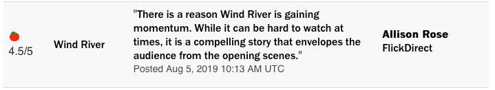
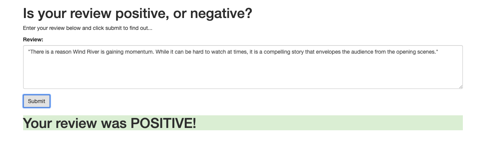
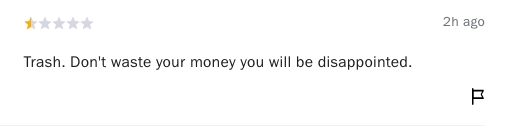
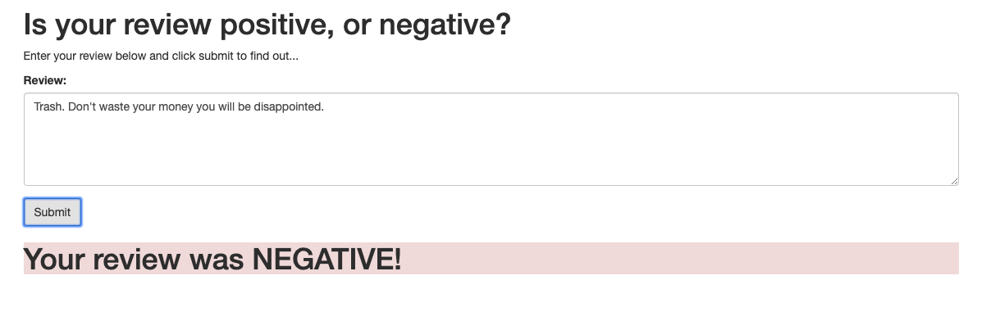
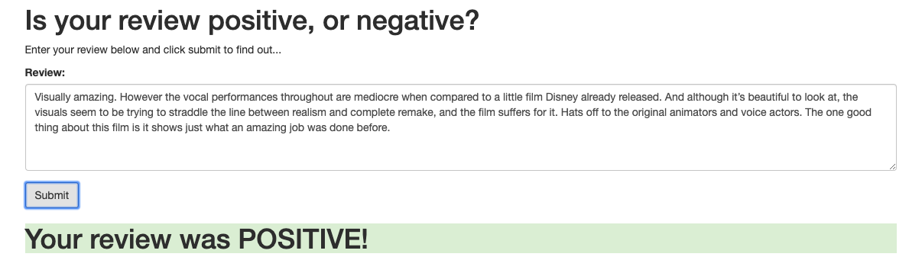

# SageMaker Deployment Project

## Introduction
In this SageMaker Deployment project, I built a recurrent neural network (RNN) for the purpose of determining the sentiment of movie review using the IMDB data set. The model was created through Amazon’s SageMaker service. Subsequently, I deployed the model and constructed a simple web app that deployed model can interact with. 

## Skills
* AWS (Amazon's SageMaker Platform, EC2 instance, Lambda, IAM)
* Understanding  of neural nets such as RNN
* Python 
* Pytorch, Numpy, Pandas

## Demo
I used reviews for The Lion King (2019) from Rotten Tomatos to test my deployed model. Here are some examples down below.  
### 1. Original post

### Our model thought... 

### 2. Original post

### Our model thought... 

### 3. Original post

### Our model thought... 

